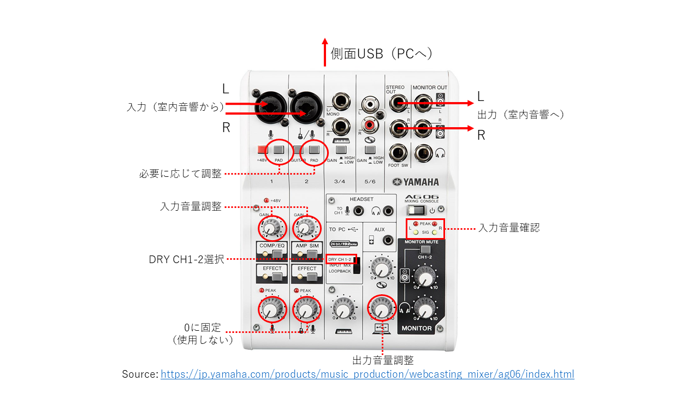

上位ページ: [対面とオンラインの同時併用授業の実施方法と必要設備について](https://kyoto-u.github.io/online-edu/zoom-hybrid-use)

# 室内音響設備をYamaha AG06経由でPCに接続する

## Yamaha AG06の設定
- スライドスイッチをDRY CH 1-2に設定
- CH-1/CH-2のGAINのツマミを調整（音響設備からPCに送る音量）2付近が標準
- 必要に応じてCH-1/CH-2のPADボタンを切り替え
- PC/USBマークのツマミを調整（PCから音響設備に送る音量）5付近が標準?
- その他のツマミは0にする（特にCH-1/CH-2の一番下のツマミは絶対上げない）

## 音響設備との接続
- 音響設備の音声出力をAG06のCH-1(L)、CH-2(R)に接続（XLR/標準プラグに変換）
  - 必要に応じてRCA（ピン）端子をXLRまたは標準プラグ（モノラル）に変換する変換コネクタを用意
- 音響設備の音声入力をAG06のSTEREO OUT L/Rに接続（標準プラグ）
  - 必要に応じてRCA（ピン）端子を標準プラグ（モノラル）に変換する変換コネクタを用意
- AG06のUSBケーブルをPCに接続
- PCのオーディオ設定（Zoom等）で、入出力をAG06に設定

## AG06以外に準備するもの
音響設備との接続にはピン（RCA）ケーブルを利用することが多いが、その場合は、標準プラグ（モノラル）とピン（RCA）の変換アダプタ等を用意する。
このようなアダプタは様々なメーカーから提供されているが、例えば以下のような製品がある。
- Audio-Technica AT514CM
- JVC AP-102A
- Sony PC-503M

## その他の参考情報
Windowsで再生音が時々歪む場合は、ドライバーをインストール（更新）すると改善する場合があるようです。
- https://jp.yamaha.com/support/updates/yamaha_steinberg_usb_driver_for_win.html

Last modified: 2020/8/10
