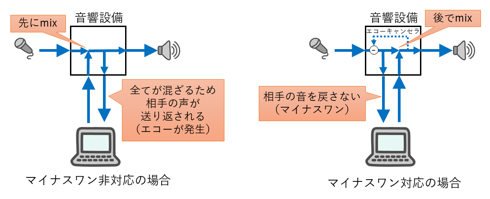
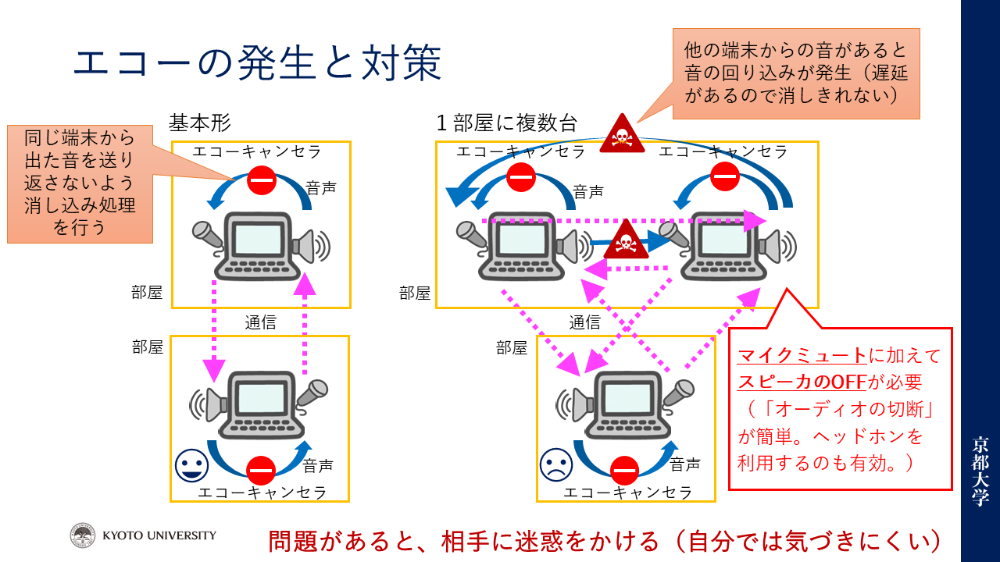

# 複数端末を利用する場合の注意（エコーを起こさないために）

オンラインミーティングがパソコンやスマートフォンから簡単に参加できるようになりました。
また、個人が自分自身の端末を持ち（いわゆるBYOD）、さらには複数の端末を持ち歩く機会も増えてきています。
このような状況では、次のような使い方のニーズが増えてきているのではないかと思います。

- 一つの部屋に、同じオンラインミーティングに参加する人が複数いる場合でも、それぞれが持つ端末でオンラインミーティングに接続し、手元で資料共有の画面などをじっくり見たい
- オンラインミーティングでプレゼンテーションする場合に、自分の画面共有が他の人にどのように見えているか確認したい
- 参加者がリモートかどうかを問わず、オンラインミーティングのアプリの機能を利用して、参加者からの反応を集めたい（チャット、挙手、投票など）
- 教員とTAが協力しながら同じ部屋からオンライン授業を行いたい

このような場合に、それぞれの端末のマイクやスピーカが有効になっていると、音の回り込みが起きることでエコーが発生してしまい、声が聞き取りづらくなってしまいます。例えば次のような状況になります。

- 風呂場やカラオケボックスでしゃべっているように響いてしまう
- 声がこもってよく聞き取れない
- 同じ調子で話しているはずなのに、変なところで声が大きくなったり小さくなったりする
- 国際電話や衛星中継のような感じで、自分の話す声が少し遅れてスピーカに戻ってくる

このような状況はエコー、ハウリング、ループ、フィードバック、acoustic couplingなどと呼ばれます（厳密な定義や違いについてはここでは触れません）。多くの場合、問題の原因を作っている場所（自分）と、声が聞き取りにくくなっている場所（相手）が異なるため、エコーが起こっていることを気づきにくいことにも注意が必要です。

以下に、このようなエコー問題が発生しないようにするための注意点を示します。

## 全員がヘッドセットを利用する

最も簡単な方法は、スピーカから出る音がマイクに戻らないようにすることです。同じ部屋にある全ての端末でヘッドセット（ヘッドフォン、イヤホン）を利用することで簡単に解決することができます。どれか１台でもスピーカから音が出ていると、ヘッドセットを利用している人が自分のマイクで発言する際にエコーが発生し、その人の発言だけ聞き取りにくくなります。

（音を聞くだけであれば、密閉型のヘッドセットを利用することにより、他の端末のスピーカから音が出ていても気にならないかもしれないが、自分が発言する場合に、自分の出している声の大きさがわからず、思わず大きな声を出してしまうことがあるので注意が必要である。）

ヘッドセットの接続方法には、アナログ接続、Bluetooth接続、USB接続などがあります。アナログ接続の場合、4極プラグで接続しますが、端子の規格に2種類あることに注意が必要です（CTIAとOMTP）。マイク端子の扱いの違いですが、最近はCTIAが主流になっているようです。
また、パソコンなどでマイク端子とスピーカ端子が別になっている場合は、変換ケーブルを用意する必要があります。

## オーディオに接続する端末を１台に限定する

１つの部屋の中に、同じオンラインミーティングに接続する端末が複数ある場合、その中でマイクとスピーカを利用する端末をどれか１台に決め、それ以外の端末では、マイクとスピーカをOFFにします。マイクをOFFにする機能（ミュート）だけだと、部屋の中で誰かが話す際に、他の端末のスピーカからの音がマイクに戻ってきてエコーが発生するため、必ずスピーカもOFFにすることが重要です。

スピーカをOFFにする操作がない場合は、音量を0にします。**Zoomの場合は、「オーディオに接続」あるいは「オーディオに参加」の操作をスキップする（接続済みの場合は「オーディオから退出」する）ことで、簡単に「マイクとスピーカをOFF」にすることができ、無駄な通信も発生しません。**

## スピーカ・マイクの利用

部屋のなかでマイクとスピーカを利用する端末を１台に決めてしまうと、スピーカの音が小さくて聞きづからったり、マイクが近くの声しか拾えず毎回マイクのところまで移動しなければならなかったりすることがあります。そのような不便を解消するために、オンラインミーティング用の「スピーカ・マイク」を接続して利用することを推奨します。数人～１０人程度用のスピーカ・マイクとして様々な製品があり、製品ごとに性能や音質が異なるので、評判の良さそうなものを入手しておくと良いでしょう。

## 部屋の音響設備との接続方法

音響設備がある部屋でオンラインミーティングを行う場合は、端末の音声入出力を部屋の音響設備に接続することができれば、別途スピーカ・マイクを用意しなくとも快適に音声のやりとりができると期待できます。しかしながら、音響設備がオンラインミーティングでの利用を想定した設計になっていない場合は、音響設備との接続がエコーを発生させる原因となることがあるので注意が必要です。

最も重要なポイントは、音響設備に送った音声がそのまま音響設備から戻ってくるようになっていないかどうか、という点です。

レコーディング用の機器を接続するために用意された接続端子の場合、そのまま音を戻すようになっていることが一般的です（その方が設備コストが安くなるため）が、音がそのまま戻ってくるとエコーが発生する原因となります。端末に備わっているエコーキャンセラ（後述）が十分に強力であれば、このようなエコーも消去されることが期待されますが、大きな音量でエコーが戻ってくることが想定されておらずエコーが消しきれなかったり、副作用として同時に話しているこちら側の声も影響を受けて削られてしまうことで聞きづらくなることがあります。

オンラインミーティングでの利用も考慮された音響設備であれば、音響設備に送った音はそのまま戻さないように回路設計がなされています。このような設計は放送業界などでは常識となっており、いわゆる「マイナスワン」と呼ばれます。

もし、音響設備がマイナスワンに対応していない場合は、音響設備をスピーカの代わりとしてのみ使用し、音響設備に備え付けのマイクは利用せずに、別途オンラインミーティング専用のマイクを準備するなどして、全体構成としてマイナスワンが実現されるような工夫が必要となることがあります。
別の方法として、スピーカ出力を音響設備に直接接続せず、端末のスピーカの音を音響設備のマイクで拾って拡声する、という対応方法もあります。
いずれの場合も、エコー問題が依然として残る場合は、相手が話している間はこちら側のマイクをミュートしておくという配慮が必要になります。

## 参考：エコーの発生するしくみとエコーキャンセラ

電話やオンラインミーティングのアプリを利用して会話をするためには１台の端末についているマイクとスピーカを利用することになります。
普通に利用しているときでも、スピーカから出た音を同じ端末のマイクで拾ってしまうため、エコーの原因となる状況は避けられません。

昔は、このようなエコーを避けるため、スピーカの音がマイクに届きにくいように「受話器」を利用するか、話していないときは必ずミュート（マイクOFF）にしておき、話すときだけミュート解除（マイクON）して必ず交互に話す、という形で対応していました。

１台の端末の視点から見ると、スピーカから出た音がマイクに戻ってくることで発生するエコーの解消のためには、自分のスピーカから出した音が、マイクから戻ってくるのであれば、その音を引き算することにより打ち消すことができる、ということが想像できます。このようなアイデアに基づいて、「エコーキャンセラ」（エコキャン）という方法が考案され、最近では、ほとんどの機器やアプリにエコーキャンセラの機能が組み込まれるようになりました。

しかし、現在のこのようなエコーキャンセラは１台の端末において発生するエコーは防止することができますが、複数の端末の組み合わせによるエコーまでは防止することができないため、利用上の注意が必要となります。（音響設備に接続した場合、複数端末環境でなくても、音の特性の変化によりエコーキャンセラが十分に機能しない場合があります。）

技術が進めば将来的には、複数の端末の組み合わせによるエコーも自動的に除去できるようになるかもしれません。

（最終更新：2020年5月27日）

