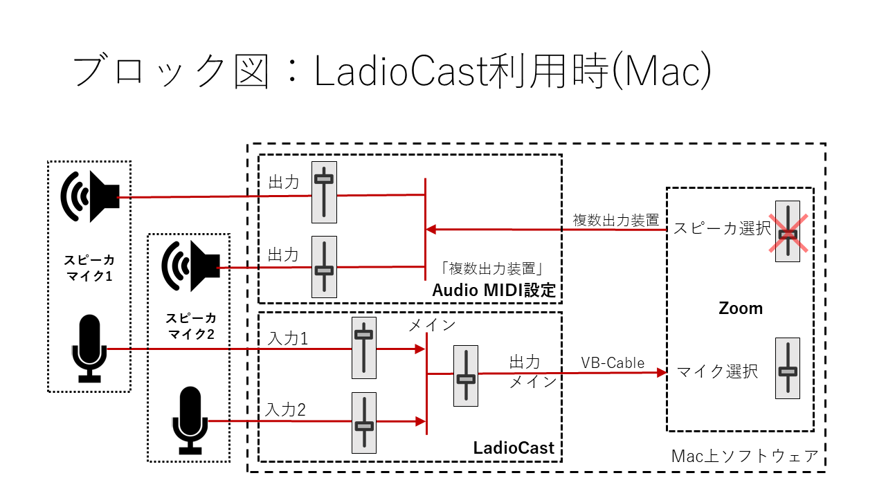
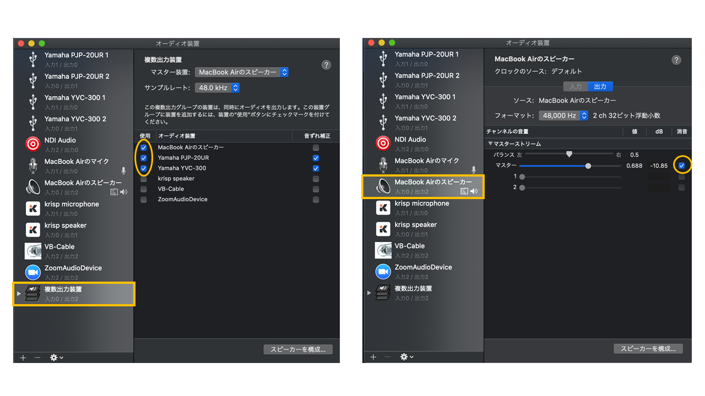
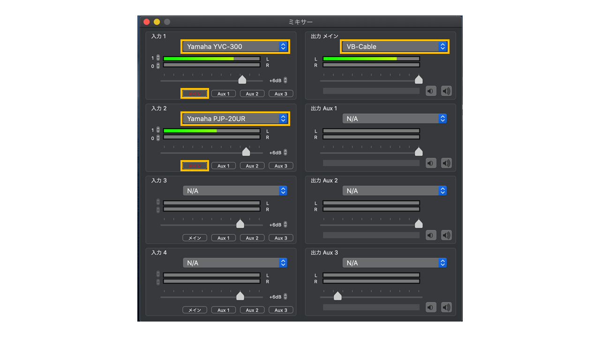

上位ページ: [対面とオンラインの同時併用授業の実施方法と必要設備について](zoom-hybrid-use)

# バーチャルミキサ LadioCast で複数のスピーカ・マイクを利用する

オーディオのミキシンクや出力先の選択を行うミキサの機能をソフトウェアで実現し、パソコン上で動作させることが可能となっている。
このようなソフトウェアはバーチャルミキサと呼ばれる。

ここでは、Macで実現する方法について紹介する。

- インターネットラジオ放送用ソフトウェア [LadioCast](https://apps.apple.com/jp/app/ladiocast/id411213048?mt=12)
- Virtual Audio Cable [VB-CABLE](https://www.vb-audio.com/Cable/)
- OS標準機能 Audio MIDI 設定 (アプリケーション>ユーティリティ)

LadioCastは4つまでの入力を扱うことができるが、ここでは2つのスピーカ・マイク（Yamaha YVC-300とPJP-20UR）を利用する例を示す。

なお、Bluetooth接続は遅延が大きいため、エコーキャンセラがうまく機能しないことがあることに注意が必要である。

## 出力（スピーカ）の複数出力設定

1. 「Audio MIDI 設定」を開く
2. 左下の「+」で「複数出力装置を作成」
3. 作成するデバイスの名前を適当に指定する（そのまま「複数出力装置」でも可）
4. 出力先とするオーディオ装置を複数指定する

以上により、Zoomのオーディオ設定画面において、スピーカとして設定したデバイスの名前（「複数出力装置」）が選択できるようになる。

なお、出力先としてスピーカマイクのみを指定すると、再生速度が遅くなることがある。
そのような場合は、Mac本体のスピーカを「マスター」として出力先に含めることで問題を回避することができる
（Mac本体のスピーカからの出力が不要な場合は、「消音」にしておく）。

## Zoomの音声出力の設定とテスト

1. Zoomクライアントを起動し、「設定」で「オーディオ」を開く
2. スピーカの選択で、設定したデバイスの名前（「複数出力装置」）を選択
3. 「スピーカのテスト」ボタンを押して、音量バランスの確認をする

「複数出力装置」を選択すると、直下の出力音量調整が効かなくなる。
その代わり、「Audio MIDI 設定」で、利用する各デバイスの「出力」のところで、個別の音量調整を行い、利用する複数機器間のバランスを調整する。

## 入力（マイク）の選択と出力先の指定

複数のマイクに入力された音をミックスするために、LadioCastのミキサー設定において、以下の設定を行う。

- 入力1: 1つめのマイク機器を選択し、出力先として「メイン」のみを選択する
- 入力2: 2つめのマイク機器を選択し、出力先として「メイン」のみを選択する
- 出力メイン: VB-Cableを選択する

## Zoomの音声入力の設定とテスト

1. Zoomクライアントの「設定」で「オーディオ」を開く
2. マイクロフォンの選択で、「VB-Cable」を選択する
3. 「マイクのテスト」ボタンを押して、マイクの動作を確認する

マイクの入力レベルは、LadioCastのミキサー設定のパネルにも表示される。
レベルメータの振れ方も参考に、LadioCastのミキサー設定のパネルで入力音量（バランス）の調整を行う。

個別のミュートボタンはないが、各入力の出力先選択で「メイン」をON/OFFすれば、ミュートの代わりとして利用できる。
