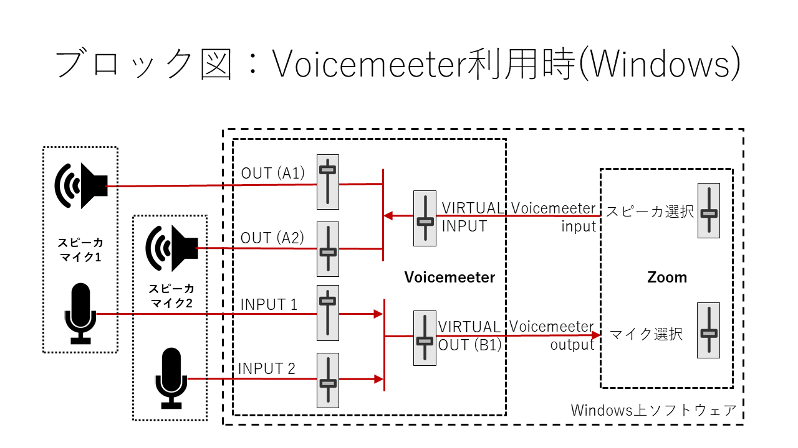
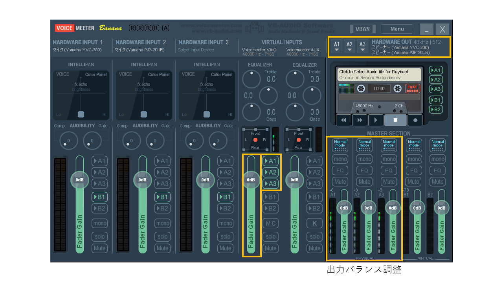
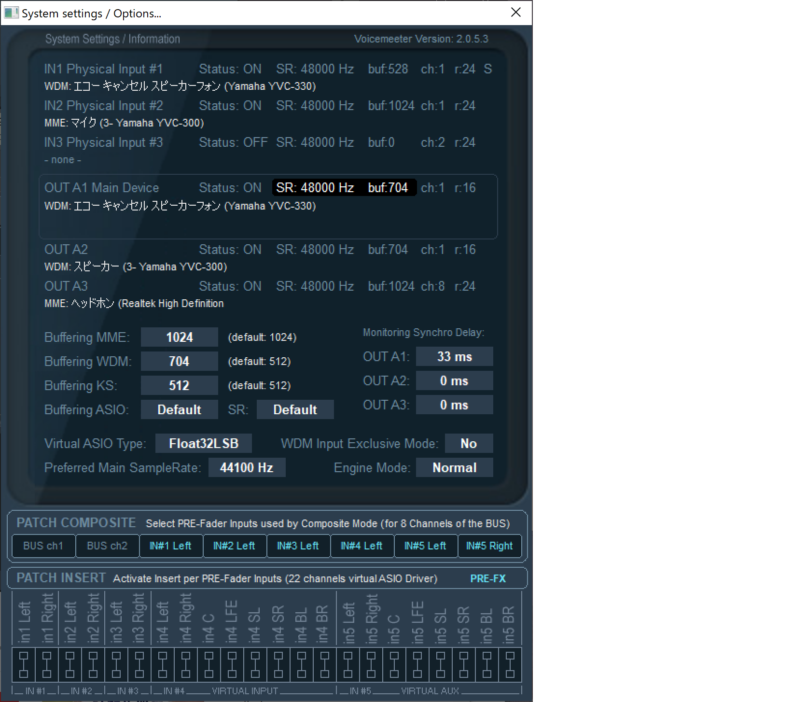
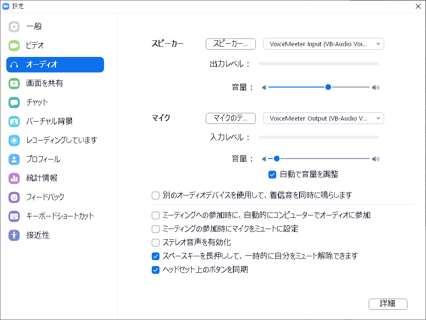

上位ページ: [対面とオンラインの同時併用授業の実施方法と必要設備について](zoom-hybrid-use)

# バーチャルミキサ Voicemeeter Banana で複数のスピーカマイクを利用する

オーディオのミキシンクや出力先の選択を行うミキサの機能をソフトウェアで実現し、パソコン上で動作させることが可能となっている。このようなソフトウェアはバーチャルミキサと呼ばれる。

ここでは、Windowsで動作するバーチャルミキサ[VB-AUDIO Voicemeeter Banana](https://www.vb-audio.com/Voicemeeter/banana.htm)の利用例について紹介する。

Voicemeeter Bananaは3つまでの入力・出力を扱うことができる。ここでは2つのスピーカマイク（Yamaha YVC-300とPJP-20UR）を利用する例を示す。
わかりやすさのために、異なる機種を利用しているが、音の遅延の違いなどによる無用のトラブルを避けるため、同一機種を利用することが望ましい。
（機器の選択以外の設定では、3つの機器を利用する設定となっている。）

なお、Bluetooth接続はさらに遅延が大きくなるため、エコーキャンセラがうまく機能しないだけでなく、ずれた音が聞こえることにより不快になったりすることがあることに注意が必要である。

## 入力（マイク）の選択と出力先の指定

- HARDWARE INPUT 1: **WDM: Yamaha YVC-300**
- HARDWARE INPUT 2: **WDM: Yamaha PJP-20UR**
- HARDWARE INPUT 3: **- remove device section -** （必要に応じて3つめの機器を指定する）

次に、HARDWARE INPUT 1/2/3のそれぞれのセクションで、フェーダ（上下に操作して音量を調整するスライドボリューム）の右横にあるボタンで**「>B1」**のみを選択（それ以外はOFFにする）。
なお、**「MUTE」**ボタンを利用して個別にミュートすることが可能。
ｓにミュートすることが可能。

## PC音声の出力先の選択

VIRTUAL INPUTSのセクションでは、2つのバーチャルオーディオデバイスについて設定可能になっているが、ここでは左側の「Voicemeeter VAIO」を利用する。
フェーダの右横にあるボタンで**「>A1」「>A2」「>A3」**を選択（それ以外はOFFにする）。

## 遅延の調整

接続した複数のスピーカマイクで同時に音を出力したときや、同時に音を入力したときに、音のずれ（遅延の差）がある場合は、設定を調整して音のずれを少なくする必要がある。
音のずれが大きいと、エコーキャンセラが正常に機能せず、エコーが発生したり、不必要に音が消去されて安定して声が届かなくなったりすることがある。
数十ミリ秒ずれると、声が聞きづらいだけでなく、気分が悪くなることもあるため、注意が必要である。

### スピーカの遅延の調整

右上の「メニュー」から「System settings/options」を開き、中央右のMonitoring Syncro Delayの項目を調整する。
機器ごとに加える遅延をミリ秒単位で指定する。時報など音のタイミングが明確にわかる音源を再生しながら遅延を調整すると良い。

### マイクの遅延の調整

マイクからの入力音の遅延については、前項のような設定項目がないため、他の方法で調整する必要がある。
「System settings/options」を開き、中央左のBuffering MME/WDM/KSの値を調整することで、遅延を制御することができる。
バッファはノイズ防止等のために設けられた仕組みであるが、音のデータを蓄積するバッファの機能は遅延を伴うことから、バッファの容量を操作すうことで、遅延を調整することができる。
Windowsにおいてマイクやスピーカを接続する際のインタフェース規格として、MME/WDM/KSなどがあるが、それぞれの仕組みの技術的な特性上、それぞれで遅延が異なる。
また、Voicemeeterでは、それぞれに対して個別にバッファのサイズを指定することができるようになっている。
これらを利用して、マイクごとに異なるインタフェース規格を指定し、それぞれのバッファのサイズを調整することで、マイク間の遅延を調整することができる。

実際の調整では、2つのマイクを近くに置き、時報など音のタイミングが明確にわかる音源をマイクに入力しながら、ミキシングされた音をヘッドフォンなどで聴きながら遅延を調整すると良い。

## Zoomのオーディオ設定

Voicemeeter Bananaをインストールすると、以下の仮想デバイスが追加される。

- スピーカ: VoiceMeeter Input
- スピーカ: VoiceMeeter Aux Input
- マイク: VoiceMeeter Output
- マイク: VoiceMeeter Aux Output

この中から、Zoomのオーディを設定では次のように指定する。

- スピーカの機器として**「VoiceMeeter Input」**を選択する
- マイクの機器として**「VoiceMeeter Output」**を選択する

### Zoomでの設定テスト

1. Zoomのオーディオ設定画面で「スピーカのテスト」をクリックして、Voicemeeterのレベルメータが振れ、選択した複数のスピーカから音が聞こえることを確認する。
2. マイクに向かって話すと、Voicemeeterのマイクのレベルメータが振れることを確認する。また、Zoomのオーディオ設定画面で「マイクのテスト」をクリックして、マイクに向かって話した声が、スピーカから再生されることを確認する。

