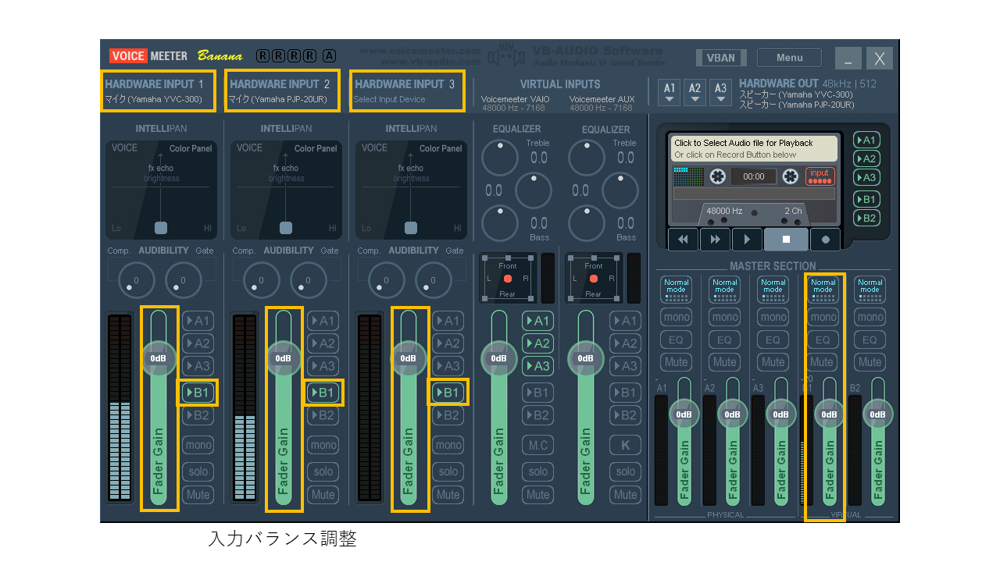

上位ページ: [対面とオンラインの同時併用授業の実施方法と必要設備について](zoom-hybrid-use)

# バーチャルミキサ Voicemeter Banana で複数のスピーカ・マイクを利用する

オーディオのミキシンクや出力先の選択を行うミキサの機能をソフトウェアで実現し、パソコン上で動作させることが可能となっている。このようなソフトウェアはバーチャルミキサと呼ばれる。

ここでは、Windowsで動作するバーチャルミキサ[VB-AUDIO Voicemeter Banana]([https://www.vb-audio.com/Voicemeeter/banana.htm)の利用例について紹介する。

Voicemeter Bananaは3つまでの入力・出力を扱うことができるが、ここでは2つのスピーカ・マイク（Yamaha YVC-300とPJP-20UR）を利用する例を示す。
（機器の選択以外の設定では、3つの機器を利用する設定となっている。）

## 入力（マイク）の選択と出力先の指定

- HARDWARE INPUT 1: **WDM: Yamaha YVC-300**
- HARDWARE INPUT 2: **WDM: Yamaha PJP-20UR**
- HARDWARE INPUT 3: **- remove device section -** （必要に応じて3つめの機器を指定する）

次に、HARDWARE INPUT 1/2/3のそれぞれのセクションで、フェーダ（上下に操作して音量を調整するスライドボリューム）の右横にあるボタンで**「>B1」**のみを選択（それ以外はOFFにする）。
なお、**「MUTE」**ボタンを利用して個別にミュートすることが可能。

利用する複数のマイクの間での音量バランスの調整は、HARDWARE INPUT 1/2/3それぞれのフェーダを利用する。

ミックスされた音はB1からPCに送られるので、全体の音量は右下にあるVIRTUAL B1のフェーダで調整する。

### 補足

MME (windows MultiMedia Extensions)はWDM (Windows Driver Model)より古いインタフェース規格であり、遅延（音の遅れ）が少し大きい。どちらも選択できる場合はWDMを選択する方が良いが、利用する複数音機器で統一した方が良いと思われる。
また、WDMは排他制御を行うため、他のアプリで利用中の機器を選択できないことがある。

## 出力（スピーカ）の選択

- A1: **WDM: Yamaha YVC-300**
- A2: **WDM: Yamaha PJP-20UR**
- A3: **- remove device section -** （必要に応じて3つめの機器を指定する）

利用する複数のスピーカの間での音量バランスの調整は、A1/A2/A3それぞれのフェーダを利用する。
なお、**「MUTE」**ボタンを利用して個別にミュートすることが可能。

## PC音声の出力先の選択

VIRTUAL INPUTSのセクションでは、2つのバーチャルオーディオデバイスについて設定可能になっているが、ここでは左側の「Voicemeter VAIO」を利用する。
フェーダの右横にあるボタンで**「>A1」「>A2」「>A3」**を選択（それ以外はOFFにする）。

## Zoomのオーディオ設定

Voicemeter Bananaをインストールすると、以下の仮想デバイスが追加される。

- スピーカ: VoiceMeter Input
- スピーカ: VoiceMeter Aux Input
- マイク: VoiceMeter Output
- マイク: VoiceMeter Aux Output

この中から、Zoomのオーディを設定では次のように指定する。

- スピーカの機器として**「VoiceMeter Input」**を選択する
- マイクの機器として**「VoiceMeter Output」**を選択する

### Zoomでの設定テスト

1. Zoomのオーディオ設定画面で「スピーカのテスト」をクリックして、Voicemeterのレベルメータが振れ、選択した複数のスピーカから音が聞こえることを確認する。
2. マイクに向かって話すと、Voicemeterのマイクのレベルメータが振れることを確認する。また、Zoomのオーディオ設定画面で「マイクのテスト」をクリックして、マイクに向かって話した声が、スピーカから再生されることを確認する。

